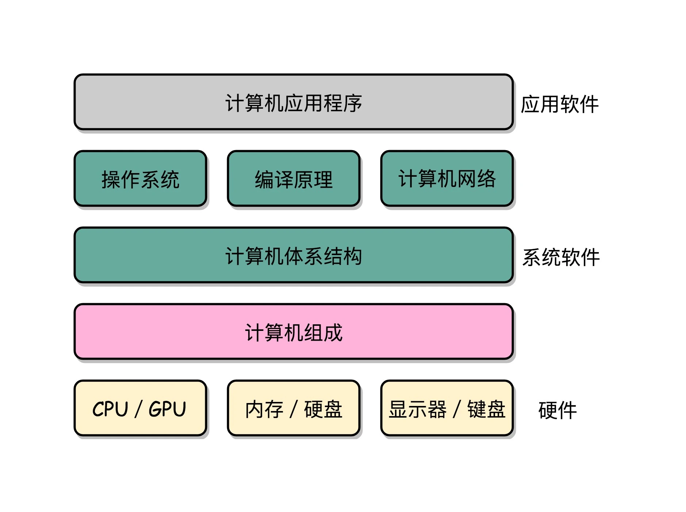

### 计算机组成原理

计算机组成原理通过**指令、计算、CPU、存储系统和 I/O **串起来

### 冯·诺依曼体系结构

CPU、主办、内存

主板的芯片组、总线解决cpu和内存通信的问题

**存储程序计算机**

- 可编程
- 存储

**组成**

- 处理器单元（Processing Unit）：包含算术逻辑单元（Arithmetic Logic Unit，ALU）和处理器寄存器（Processor Register）
- 控制器单元（Control Unit/CU）：包含指令寄存器（Instruction Register）和程序计数器（Program Counter）
- 内存。以及更大容量的外部存储：用来存储数据（Data）和指令（Instruction）
- 输入输出设备。

所有的计算机程序，也都可以抽象为从**输入设备**读取输入信息，通过**运算器**和**控制器**来执行存储在存储器里的程序，最终把结果输出到**输出设备**中。而我们所有撰写的无论高级还是低级语言的程序，也都是基于这样一个抽象框架来进行运作的。

学习组成原理，其实就是学习控制器、运算器的工作原理，也就是 CPU 是怎么工作的，以及为何这样设计；学习内存的工作原理，从最基本的电路，到上层抽象给到 CPU 乃至应用程序的接口是怎样的；学习 CPU 是怎么和输入设备、输出设备打交道的。

