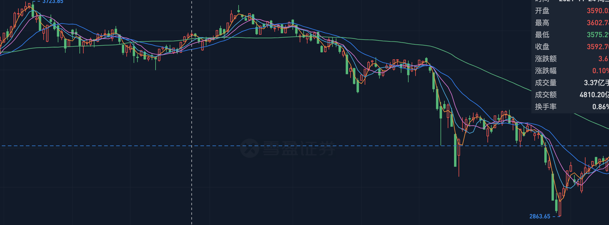
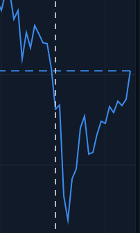
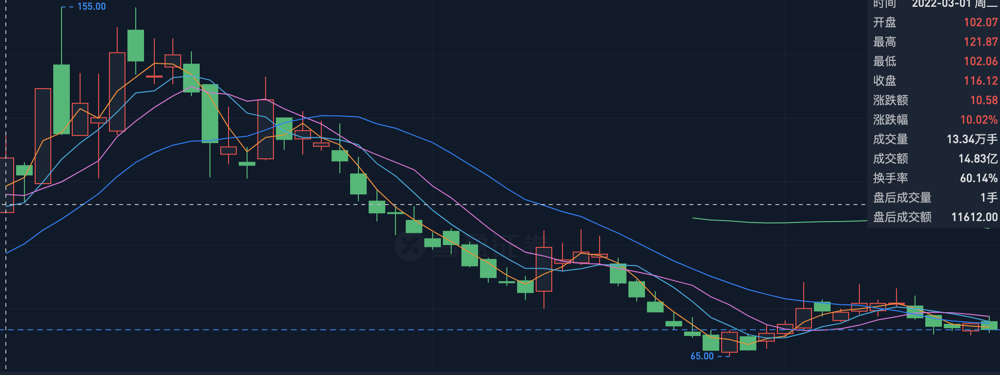
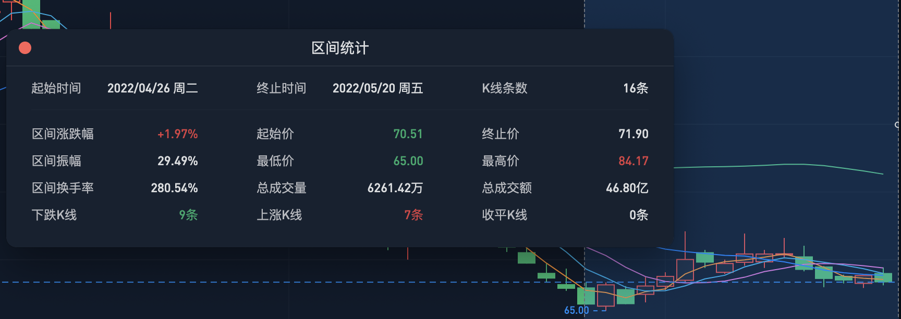
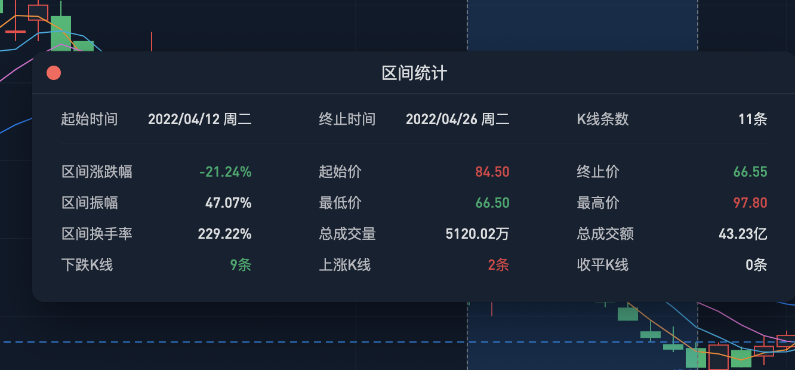
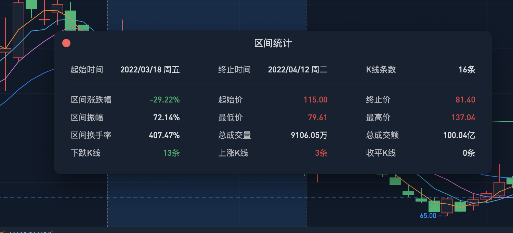

### 上证指数

周五跳空高开一路向上，交易金额4100亿，没有足够资金。相比之前3月奇迹日（5000亿成交金额）略少，形成压力位。周一上攻回落收十字星，周二缩量下跌3000-2990支撑位（05-06、05-09分别是3400亿、2900亿成交）

### 个股：诚达

成本价：100

反弹三步骤：止跌、站上均线系统、放量。

量能不足 来自换手不足，缩量。

短期上影线的交易金额：5亿 4.9亿 3.1亿 钝化。 5天达到75%换手可以入场。

周一冲高回落放量，周二缩量下跌，周三十字星，周四周五反复吸筹。